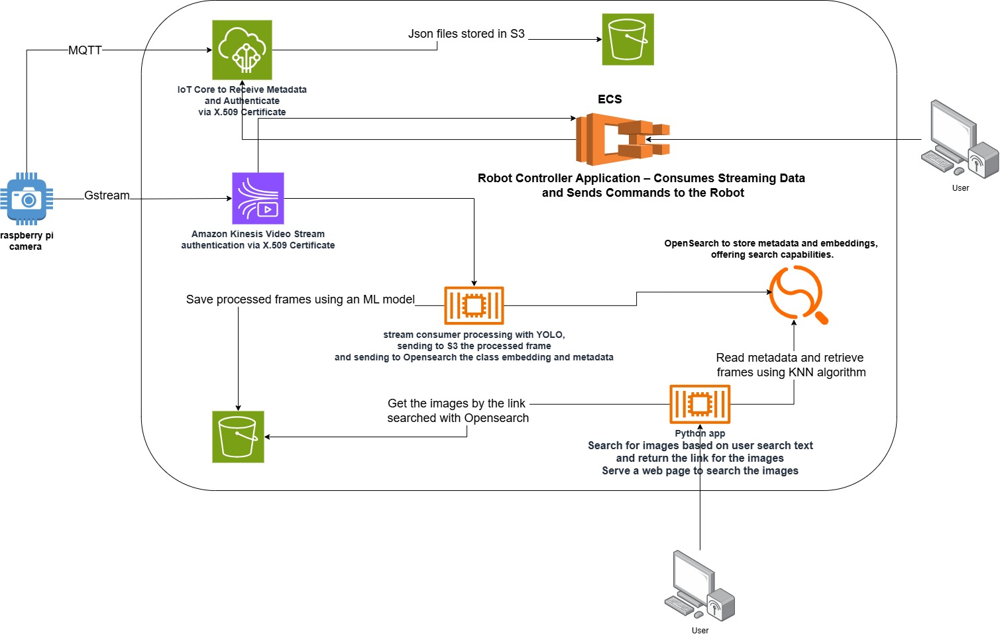

# AI-Robotic_system

## 🧠 Robot Controller Application

This project implements a robot controller that consumes streaming data, detects and tracks objects, and sends movement commands to the robot. It also supports gesture recognition and integrates with an LLM (Large Language Model) to define which objects the robot should follow.

### ✅ Features

- 🔍 **Object Detection** using YOLO  
- 🎯 **Object Tracking** for autonomous robot following  
- 🧠 **LLM Integration** to dynamically define target objects  
- ✋ **Gesture Detection** for human-robot interaction  

### 🌐 Environments Supported

- 🖥️ **Server on a Local Network**  
- 🐍 **Standalone Python Script**  
- ☁️ **Cloud Deployment**

---

